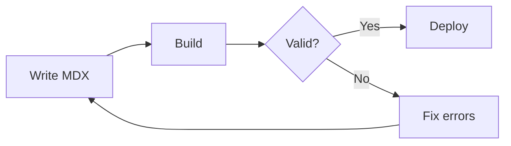
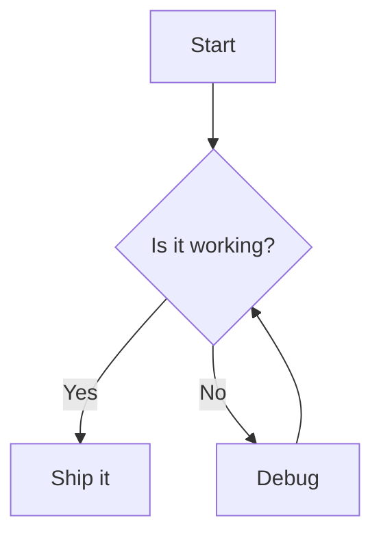
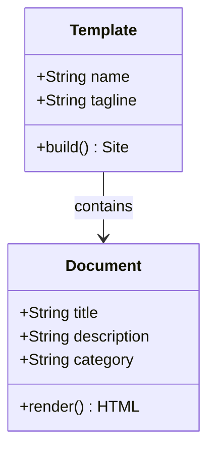

import Mermaid from '~/components/Mermaid.astro';

Mermaid diagrams render client-side when the page loads. Toggle the light/dark theme switch to see diagram colors update automatically.

## Fenced code block

Any fenced code block with the `mermaid` language tag renders as a diagram automatically. No import needed.



## Explicit component

Import `<Mermaid>` for more control. Pass the diagram source via the `chart` prop.

### Props

| Prop | Type | Required | Purpose |
|---|---|---|---|
| `chart` | `string` | yes | Mermaid diagram definition. |

### Usage

````mdx
import Mermaid from '~/components/Mermaid.astro';

<Mermaid chart={`
sequenceDiagram
    participant Browser
    participant Server
    Browser->>Server: GET /health
    Server-->>Browser: {"status":"ok"}
`} />
````

### Live example

<Mermaid chart={`
sequenceDiagram
    participant Browser
    participant Server
    Browser->>Server: GET /health
    Server-->>Browser: {"status":"ok"}
`} />

## More diagram types

### Flowchart



### Class diagram



## Error handling

Invalid mermaid syntax shows a styled error with the source and error message instead of breaking the page.

<Mermaid chart="this is not valid mermaid syntax" />
